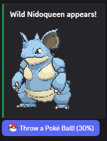

# TallGrass
A Discord bot to spawn collectible Pokemon on your server



## Commands
`/init` [ADMIN ONLY] Set up the database for TallGrass

`/start` [ADMIN ONLY] Start spawning Pokémon in this channel. Optionally accepts an active window in military time

`/stop` [ADMIN ONLY] Stop spawning Pokémon in this channel

`/box` View your Pokémon collection. Optionally accepts another user to view

`/trade` Post a trade offer

## Setup

Requires discord scopes `bot` and `applications.commands`

Bot Permissions
- View Channels
- Send Messages
- Embed Links
- Attach Files
- Use External Emojis

Install python requirements
```
pip install --upgrade -r requirements.txt
```

Install [Gifsicle](https://www.lcdf.org/gifsicle/) for sprite resizing
```
sudo apt-get install gifsicle
```

Set up environment variables
```
cp .env.example .env
echo -e "APPLICATION_ID=YOUR_APP_ID\nDISCORD_TOKEN=YOUR_TOKEN" >> .env
```

Run the emoji upload script
```
python3 emoji_upload/upload_emojis.py
```
Manually upload any emojis that fail to the developer portal.
See `emoji_upload/manually_fixed/` for a few resized emojis (the ones that failed for me)

Retrieve their `EMOJI ID` values, then add them to emoji_map.json. To validate that all Pokémon have an emoji, you can run the verification script
```
python3 emoji_upload/validate_emoji_map.py
```

Manually upload `emoji_upload/manually_fixed/pokeball.png` to the developer portal, then add it to your .env
```
echo -e "\nPOKEBALL_EMOJI_ID=YOUR_POKEBALL_EMOJI_ID" >> .env
```

Tweak the environment variables in .env to your liking

Run the bot
```
python3 main.py
```

In your server, run `/init` to create the embedded database

Now you can run `/start` in any channel to start spawning Pokémon!